## Summary
This project focuses on creating a perception pipeline inside a ROS environment so as to enable a robot to perform a pick and place task for standard packaged products. Inspiration for this project is obtained from the Amazon Robotics Challenge. Challenges involved in this projects are isolating the product from surrounding, obtaining the location and centroid of the object, distinguishing the objects to define its type.

First task in this project is to obtain the camera input image. Below figure shows the input image capture by the camera on the head of the robot. As it can be seen there are three objects placed on a table. It can also be seen that there is some background noise capture by the camera.

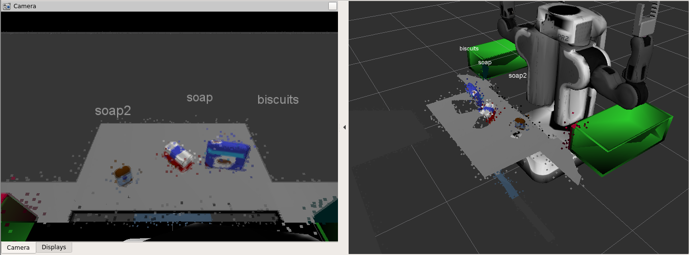

### Statistical Outlier Filtering
First step is filtering point cloud data and remove the noise. For this purpose a Statistical Outlier Removal Filter is used. The results post filtering can be seen below.
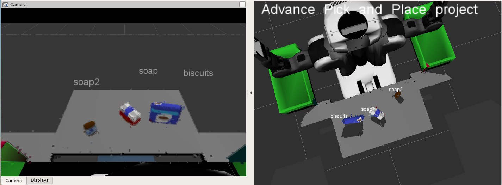

### Voxel Grid Down sampling
Once noise free image is obtained the next step is to down sample the point cloud. This process helps in increasing the processing speed without affecting the end results by a considerable margin. Below are two images obtained as a result of down sampling using leaf size of 0.01 and 0.05. As the objective is to preserve the high level details of the image a leaf size of 0.01 is chosen for our application.
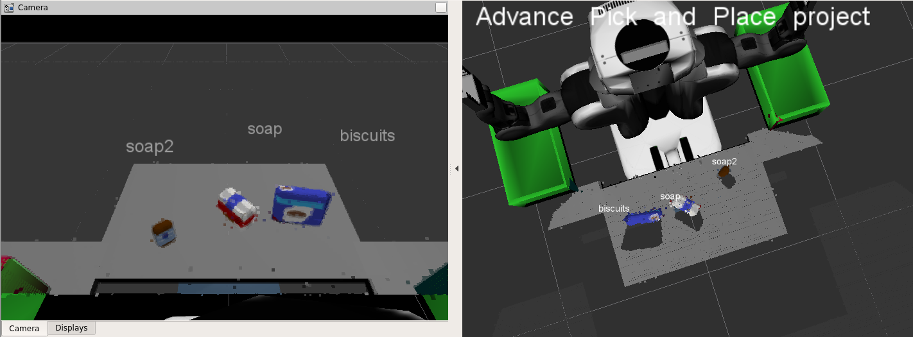
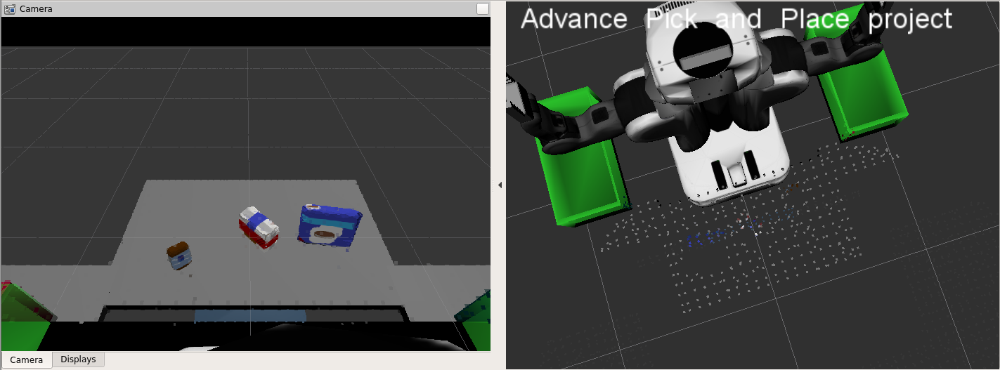

### RANSAC (Random Sample Consensus) Plane Fitting
An important task of this project is to separate the objects from the table. To do this RANSAC algorithm is leveraged. Herein, the table is modelled as a plane and is extracted from the point cloud data as inliers. Later this information is used to subtract the table from the scene and extract the products as outliers.
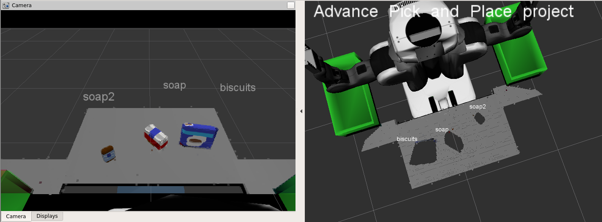
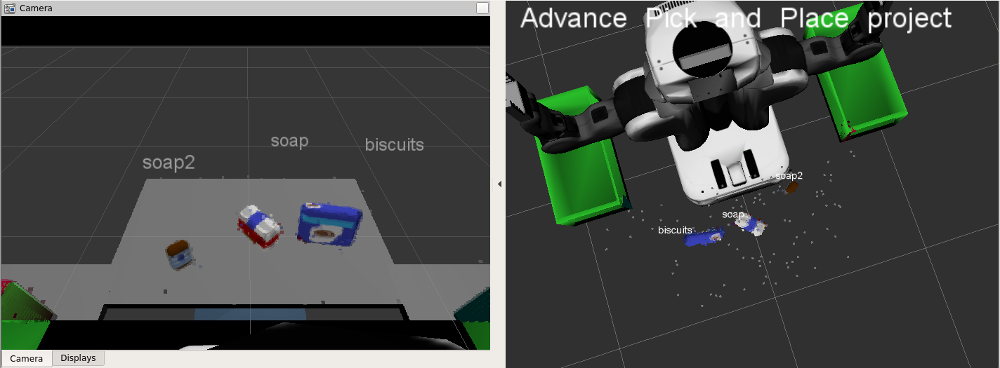

### Clustering
After the objects are extracted from the scene next task is of separating them into their respective types. This task is performed by implementing PCL Euclidean clustering on the input data. Here, a k-d tree is constructed on bases of the spatial PCL data followed by a cluster extraction function which will output a list of all the clusters into cluster_indices. Below is a cluster visualization obtained for the objects in test world one.
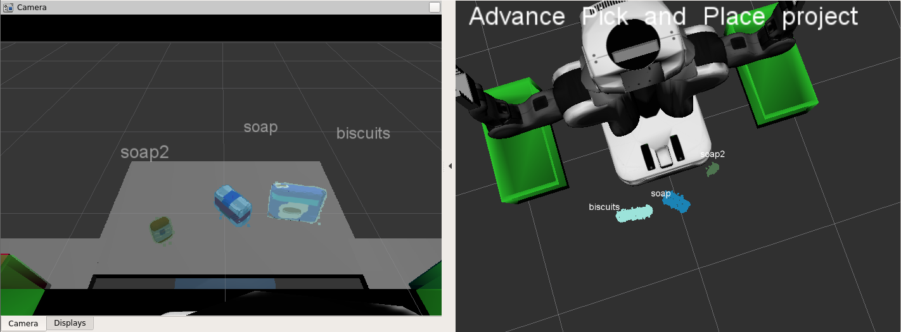

### Pass Through Filtering
Before moving further on it is important to go a step back and realize that often there is a possibility of having unnecessary objects in the scene (as seen in the figure below) which can be eliminated by simply cropping the region of interest. To achieve this a Pass Through Filter is used which can crop the data points in either axis. This filter is useful to remove things like base of the table, bins from the image, etc. For better usability and efficiency this filter is implemented right after Voxel Grid Down Sampling.
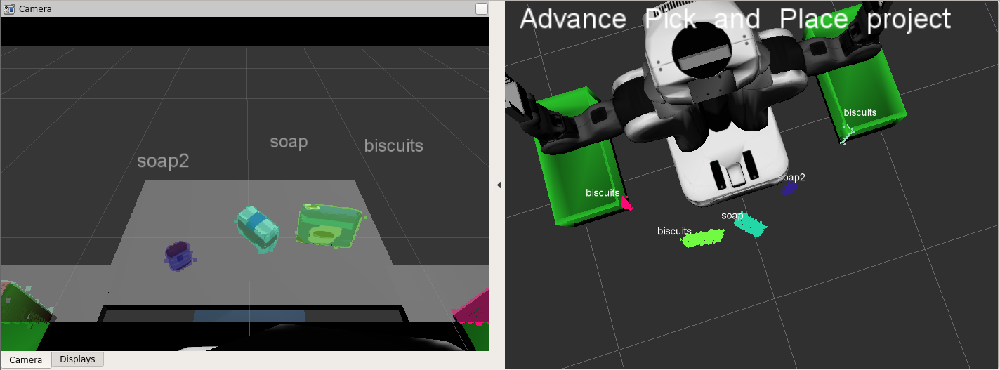

### Feature Collection and Training
In ROS environment, training.launch file is used to launch Gazebo training environment. Next, capture_feature.py program takes the pcl data and extracts the HOG features for each object in the pickup list of the world. This process is repeated around 250 times for each object having randomized orientation. Next train.cvm.py and training_set.save files are used to build a SVM based classification model. Confusion matrixes related to this model are shown in figure 9 and 10.
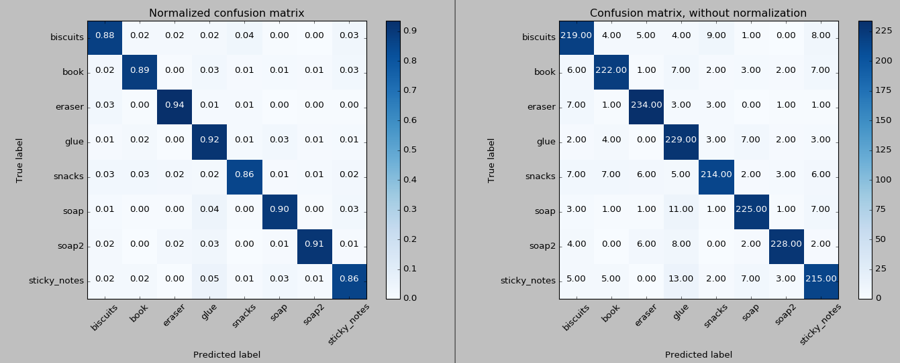

### Object Detection
## Results
### World 1
Below is an input image from the scenario ‘test world 1’. It can be observed that all the three objects on the table are correctly identified.
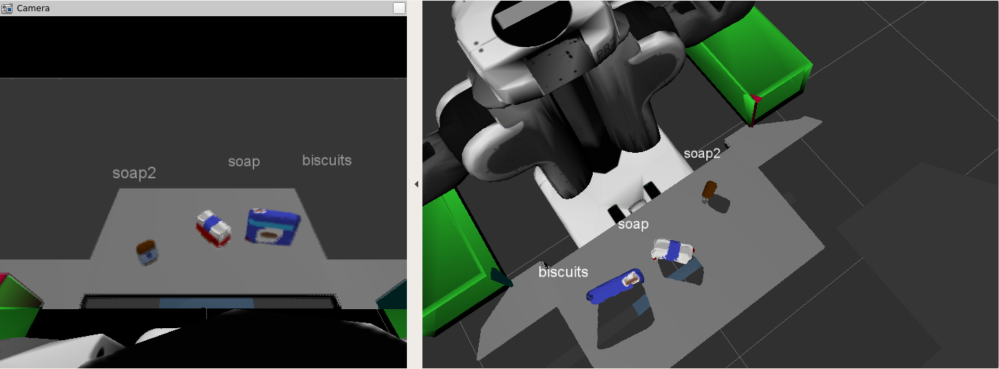

### World 2
Below is an input image from the scenario ‘test world 2’. It can be observed that all the five objects on the table are correctly identified.
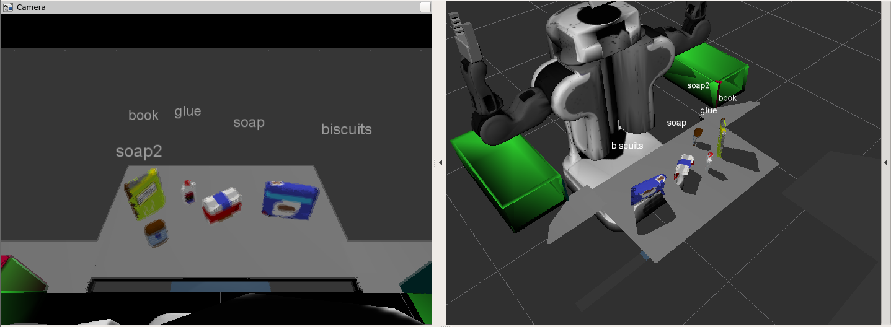

### World 3
Below is an input image from the scenario ‘test world 3’. It can be observed that all the eight objects on the table are correctly identified.
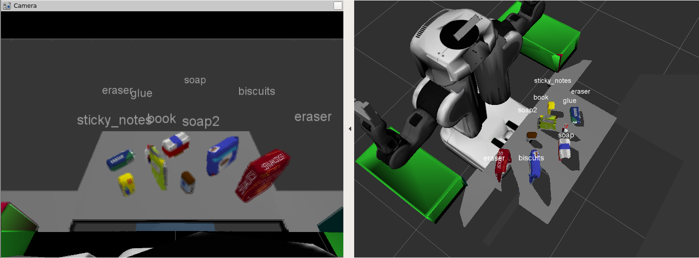
