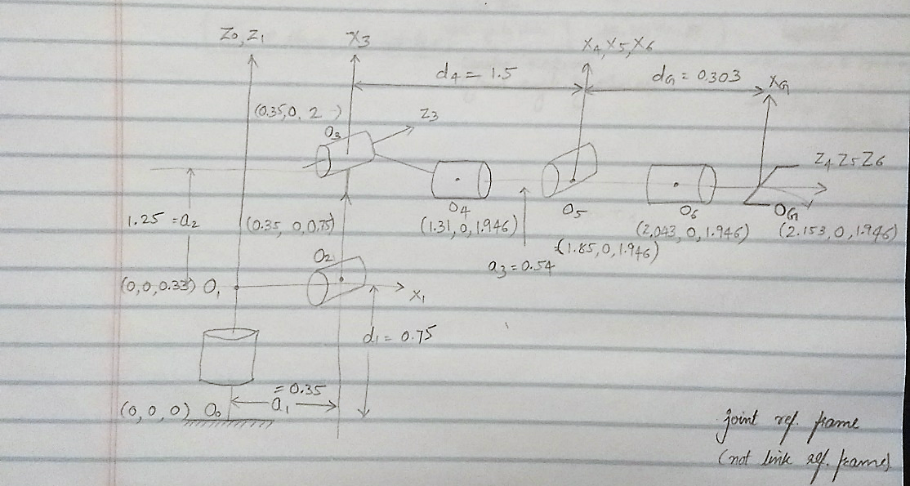
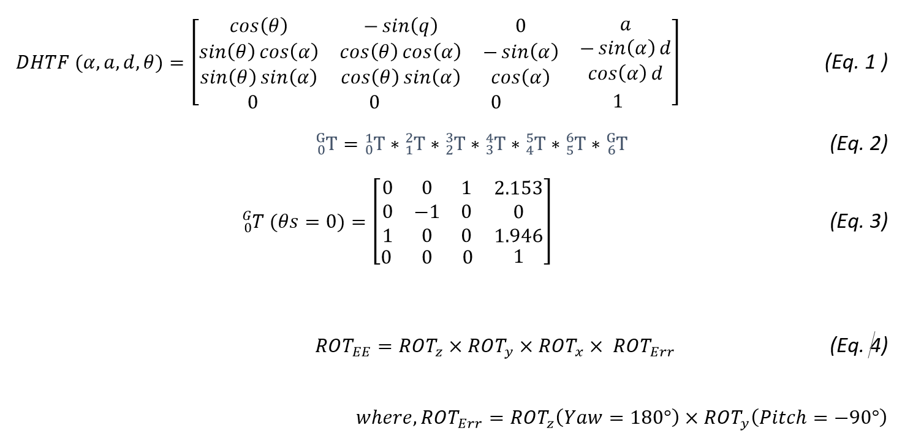
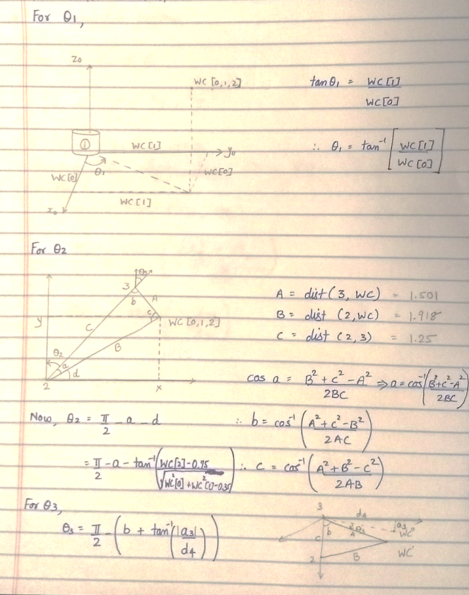
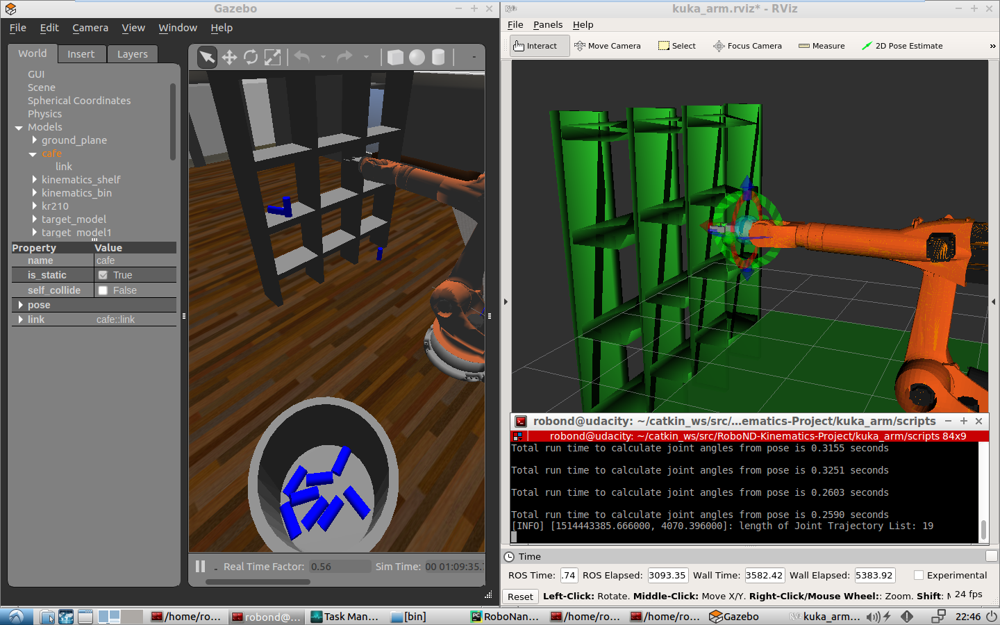
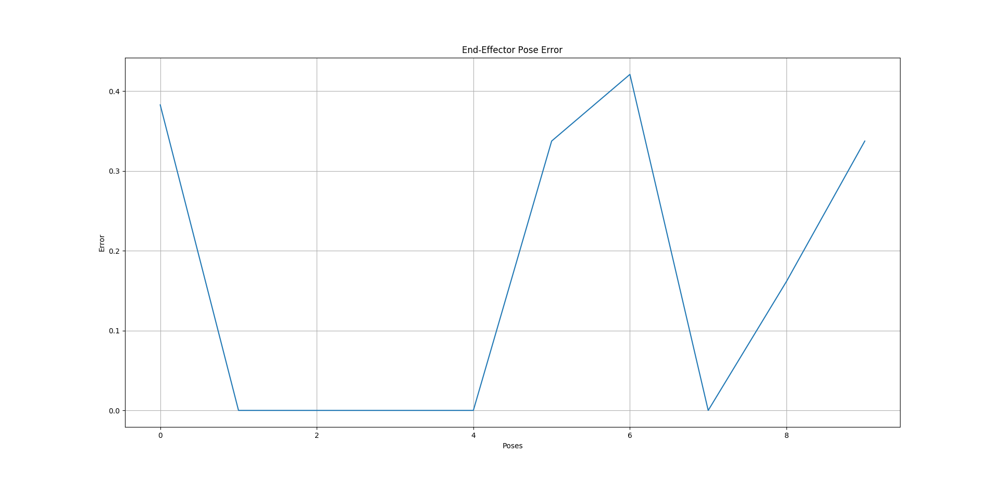
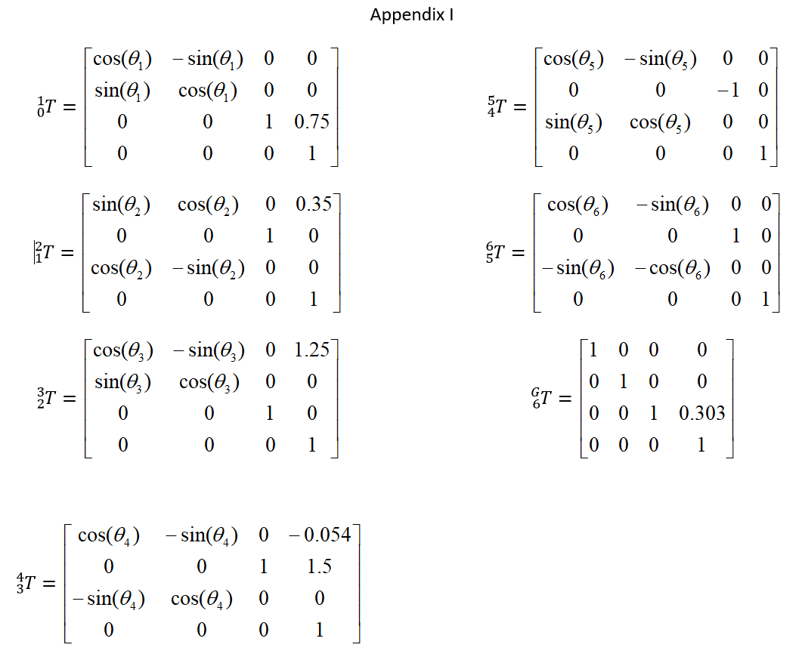
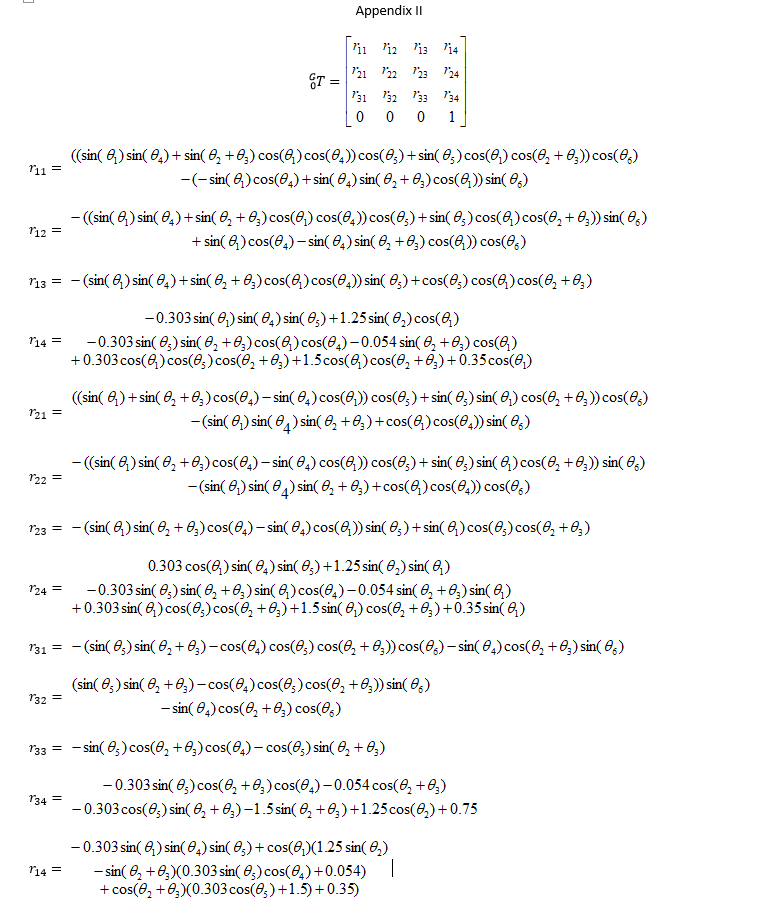

## Summary
The project demonstrates a practical usecase of forward and inverse kinematics theory to control a 6 DoF Robotic Manipulator. The robotic arm is simulated in ROS environment, leveraging capabilities of gazebo and Rviz. The path planning for the Kuka robotic arm is achieved using a script on the server performing IK calculations.

## Kinematic Analysis to obtain DH parameters
First start by obtaining DH parameters. Run ‘forward_kinematics.py’ in the ROS environment. Extract robots parameters from the URDF file as shown in Table 1. This information is then used to create a sketch of the robotic arm with joint link and rotations (Figure 1). Modified DH parameter table is generated from figure 1 and is populated in Table 2.

#### Table 1 Information extracted from the URDF File

| Joint  | Origin XYZ    |
| ------ | ------------- |
| 1      | (0, 0, 0.33)  |
| 2      | (0.35, 0, 0.42) |
| 3      | (0, 0, 1.25) |
| 4      | (0.96, 0, -0.0054) |
| 5      | (0.193, 0, 0) |
| 6      | (0.193, 0, 0) |

#### Table 2 Modified DH Parameters
 
| Links | alpha (i-1) | a (i-1) | d(i-1) | theta(i)   |
| ----- | ----------- | ------- | ------ | --------   |
| 0->1  | 0           | 0       | 0.75   | q1         |
| 1->2  | -pi/2       | 0.35    | 0      | -pi/2 + q2 |
| 2->3  | 0           |1.25     | 0      | q3         |
| 3->4  | -pi/2       | -0.054  | 1.5    | q4         |
| 4->5  | pi/2        | 0       | 0      | q5         |
| 5->6  | -pi/2       | 0       | 0      | q6         |
| 6->EE | 0           | 0       | 0.303  | 0          |

## Transformation Matrix
Once the DH parameter table is obtained, the next step is to create individual transform matrix for each joint. A generalized Matrix is shown in Eq. 1. Individual transformation matrix for each links in the DH parameter table can be obtained by substituting the respective α, a, d and θ values in Eq. 1. (Ref: Appendix I for individual transformation matrixes). Next, a homogeneous transform matrix from base link to the gripper link can be obtained my multiplying all the individual link transformation matrix as shown in Eq. 2. (Ref: Appendix II for final transformation matrix from joint 0 to G). When the robot is at zero position all the theta values are zero, resulting 0G T matrix is shown in Eq. 3. Further it can be observed that the final orientation obtained for the gripper frame from the DH Parameter table does not coincide with that from the URDF file. So, to accommodate for this variance couple of intrinsic body frame rotation needs to be applied to the frame obtained from the DH table. This is shown in Eq. 4.

## Inverse Kinematics Problem
### Position Problem
Joint angles determinig positions θ1, θ2, and θ3 are calculated using simple geometric analysis which is further explained in figure 2.

### Orientation Problem
Joint angles determing orientation θ4, θ5, and θ6 are calculated by obtaining the Rotational Matrix and then extracting Euler Angels from it which is further explained in figure 3. As there are multiple solutions to this problem. Based on the behavior of the robotic arm in 'kr210_claw_moveit demo.launch' it was observed that for negative θ5, θ4 is positive, θ6 is negative and vice-versa.

### IK_Server.py
Above concepts and calculations are converted to a python script and implemented in IK_Server.py. Initially, the time taken for computing each joint angle in inverse kinematics was ~1s. By reordering the equation and taking the calculation of constant values out of the loop the loop time is reduced by a third.

## Results
Using the Continue button on RViz GUI, the robot was allowed to run ten times and as seen in the Figure 4 it was able to pick and place 8/10 objects.

##  End-Effector Pose Error
The error between the poses received from the simulator and those calculated based on forward kinematics with the calculated thetas is logged into ‘error.txt’ by IK_server.py. Then, ‘IK_Err_Plot.py’ is ran in parallel to generate a live plot of error.

## Appendix

