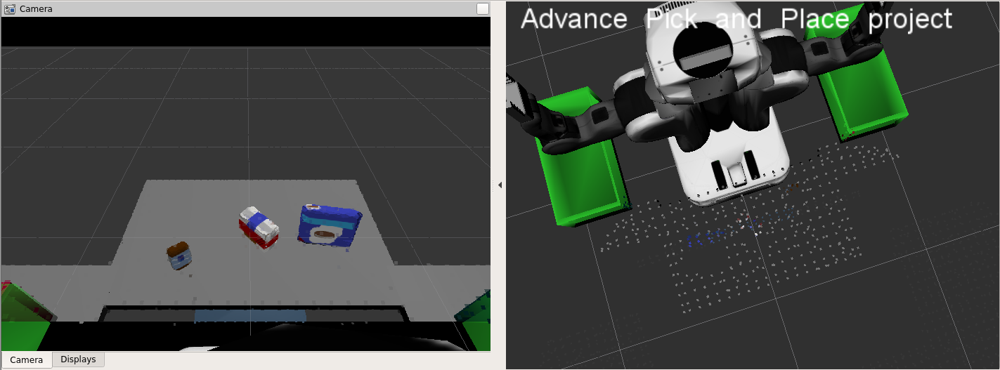

## Summary
This project focuses on creating a perception pipeline inside a ROS environment so as to enable a robot to perform a pick and place task for standard packaged products. Inspiration for this project is obtained from the Amazon Robotics Challenge. Challenges involved in this projects are isolating the product from surrounding, obtaining the location and centroid of the object, distinguishing the objects to define its type.

First task in this project is to obtain the camera input image. Below figure shows the input image capture by the camera on the head of the robot. As it can be seen there are three objects placed on a table. It can also be seen that there is some background noise capture by the camera.

### Statistical Outlier Filtering
First step is filtering point cloud data and remove the noise. For this purpose a Statistical Outlier Removal Filter is used. The results post filtering can be seen below.

### Voxel Grid Down sampling

### RANSAC (Random Sample Consensus) Plane Fitting

### Clustering

### Pass Through Filtering

### Feature Collection and Training

### Object Detection
## Results
### World 1

### World 2

### World 3

